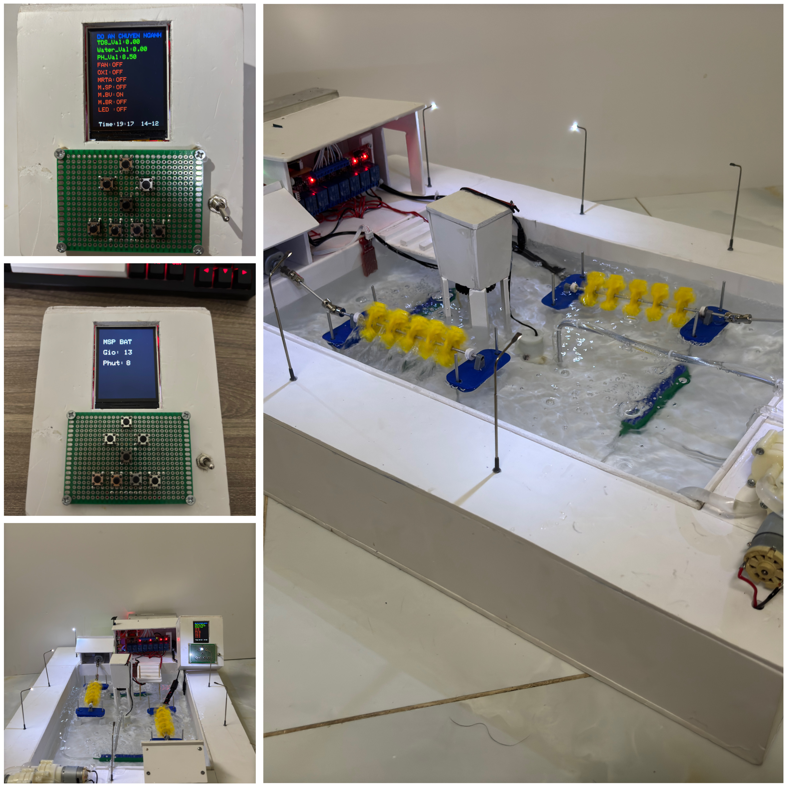

# Đồ Án Chuyên Ngành - Hệ Thống Ao Nuôi Tôm Thông Minh

## Giới thiệu
Dự án **Ao Nuôi Tôm Thông Minh** là phiên bản nâng cấp toàn diện dựa trên ý tưởng ban đầu của hệ thống ao nuôi tôm trước đó. Mục tiêu chính của dự án:
- **Nâng cao khả năng giám sát và điều khiển** hệ thống ao nuôi thông qua bộ điều khiển trung tâm.
- **Loại bỏ giới hạn tầm xa của Bluetooth HC-06**, thay thế bằng Zigbee CC2530 để cải thiện khả năng truyền dữ liệu.
- **Áp dụng FreeRTOS**, cho phép các task chạy song song, tối ưu hiệu suất hệ thống.

Hệ thống này không chỉ cung cấp khả năng tự động hóa mà còn hỗ trợ điều khiển thủ công, tạo nên một giải pháp hiệu quả, thực tiễn và tiềm năng thương mại hóa.

---

## Công nghệ và phần cứng sử dụng
### Phần cứng:
- **ESP32**: Vi xử lý chính, hỗ trợ FreeRTOS và giao tiếp Zigbee.
- **Zigbee CC2530**: Giao thức truyền dữ liệu tầm xa.
- **Cảm biến TDS**: Đo chất hòa tan trong nước.
- **Cảm biến pH (PH-4502C)**: Đo độ pH trong nước.
- **Cảm biến ánh sáng (LDR)**: Kích hoạt đèn ao nuôi tự động.
- **Cảm biến mức nước**: Theo dõi và điều khiển mức nước tự động.
- **Relay (x7)**: Điều khiển các thiết bị:
  - Quạt sục oxi.
  - Máy bơm oxi.
  - Máy xi-phông.
  - Máy rải thức ăn.
  - Máy bơm vào.
  - Máy bơm ra.
  - Đèn ao nuôi.
- **Màn hình LCD ILI9341**: Hiển thị thời gian thực, trạng thái thiết bị và thông số nước.

### Công nghệ:
- **FreeRTOS**: Quản lý đa nhiệm, đảm bảo các task hoạt động song song mà không xung đột.
- **Zigbee Protocol**: Truyền dữ liệu không dây giữa các thiết bị.
- **Real-Time Clock (RTC)**: Đồng bộ thời gian thực với internet.

---

## Tính năng
### Tính năng chính:
1. **Giám sát thông số ao nuôi:**
   - Đo chỉ số TDS, pH, và mức nước.
   - Hiển thị thông số trên màn hình LCD ILI9341.
2. **Điều khiển thiết bị:**
   - Kích hoạt thủ công hoặc tự động các thiết bị:
     - Quạt sục oxi, máy bơm oxi.
     - Máy xi-phông, máy rải thức ăn.
     - Máy bơm vào/ra.
     - Đèn ao nuôi.
3. **Tự động hóa:**
   - Bật/tắt đèn ao nuôi dựa trên cảm biến ánh sáng.
   - Máy bơm nước hoạt động tự động khi mức nước vượt ngưỡng.
   - Hẹn giờ kích hoạt máy xi-phông và máy rải thức ăn.
4. **Điều khiển từ xa:** Sử dụng Zigbee để kết nối và điều khiển hệ thống từ bộ điều khiển trung tâm.

---

## Hướng dẫn đấu dây
### Kết nối các thiết bị:
#### Cảm biến:
- **TDS Sensor**:
  - **VCC** → 5V trên ESP32.
  - **GND** → GND trên ESP32.
  - **Analog Out** → Chân A1 trên ESP32.
- **pH Sensor**:
  - **VCC** → 5V trên ESP32.
  - **GND** → GND trên ESP32.
  - **Analog Out** → Chân A0 trên ESP32.
- **Cảm biến mức nước**:
  - **VCC** → Chân 12 trên ESP32.
  - **GND** → GND trên ESP32.
  - **Analog Out** → Chân 14 trên ESP32.
- **Cảm biến ánh sáng (LDR)**:
  - **Analog Pin** → Chân 39 trên ESP32.

#### Relay:
- **Quạt sục oxi** → Chân 18 trên ESP32.
- **Máy bơm oxi** → Chân 19 trên ESP32.
- **Máy xi-phông** → Chân 5 trên ESP32.
- **Máy rải thức ăn** → Chân 15 trên ESP32.
- **Máy bơm vào** → Chân 4 trên ESP32.
- **Máy bơm ra** → Chân 0 trên ESP32.
- **Đèn ao nuôi** → Chân 2 trên ESP32.

#### Zigbee CC2530:
- **TX** → Chân 16 trên ESP32.
- **RX** → Chân 17 trên ESP32.

#### Màn hình LCD ILI9341:
- **TFT_CS** → Chân 0 trên ESP32.
- **TFT_DC** → Chân 2 trên ESP32.
- **TFT_MOSI** → Chân 14 trên ESP32.
- **TFT_SCLK** → Chân 12 trên ESP32.
- **TFT_RST** → Chân 13 trên ESP32.

---

## Hướng dẫn sử dụng
1. **Flash mã nguồn**:
   - Sử dụng Arduino IDE để tải mã nguồn từ repository lên ESP32.
   - File mã nguồn:
     - `ZIGBEE_CO_LCD_FREE_RTOS.ino` (Bộ điều khiển).
     - `ZIGBEE_CHAP_HANH_FREERTOS.ino` (Khối chấp hành).

2. **Ghép nối Zigbee**:
   - Cài đặt Zigbee CC2530 để kết nối bộ điều khiển và khối chấp hành.

3. **Hoạt động:**
   - Bộ điều khiển hiển thị thông số thời gian thực và cho phép điều khiển các thiết bị.
   - Các thiết bị hoạt động tự động dựa trên cảm biến hoặc hẹn giờ, hoặc kích hoạt thủ công qua bộ điều khiển

---

## Kết quả
- **Hoạt động ổn định**: Toàn bộ hệ thống hoạt động chính xác, thực hiện đầy đủ các chức năng.
- **Hiệu quả cao với FreeRTOS**: Quản lý đa nhiệm hiệu quả, tránh xung đột giữa các thiết bị.
- **Đánh giá giảng viên**: Được đánh giá cao về tiềm năng thương mại hóa, đặc biệt nếu tích hợp thêm cảm biến oxy hòa tan.

---

## Hạn chế và hướng phát triển
### Hạn chế:
- Có độ trễ khoảng 1 giây khi kích hoạt liên tiếp nhiều thiết bị.
- Chưa tích hợp cảm biến oxy hòa tan để đánh giá chất lượng nước toàn diện hơn.
- Chưa tích hợp đầy đủ cơ chế ACK cho toàn bộ ngoại vi.
- Vẫn còn xung đột hiển thị do cơ chế ACK thô sơ của máy bơm vào và máy bơm ra.

### Hướng phát triển:
- Tích hợp cảm biến oxy hòa tan và các thông số môi trường khác.
- Sử dụng WiFi hoặc LTE để mở rộng khả năng điều khiển từ xa.
- Tối ưu lại các cơ chế ACK để giảm sự xung đột lên cơ chế hiển thị.

---

## Hình ảnh và tài liệu
### 1. Mô hình hệ thống:

### 2. Mã nguồn:
- `ZIGBEE_CO_LCD_FREE_RTOS.ino`
- `ZIGBEE_CHAP_HANH_FREERTOS.ino`

---

## Tài liệu tham khảo
- [Datasheet ESP32](https://www.espressif.com/en/products/socs/esp32)
- [FreeRTOS Documentation](https://freertos.org/)
- [Zigbee CC2530 Documentation](https://example.com/zigbee-cc2530-docs)
- [Adafruit ILI9341 LCD Documentation](https://example.com/ili9341-docs)
